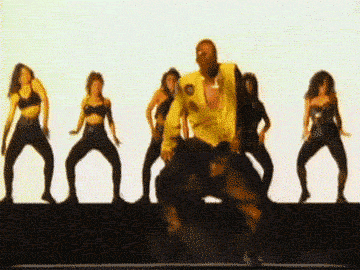
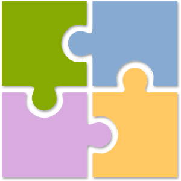

## Or... 

<!-- Global Caching --> 
```{r setup, include=FALSE}
knitr::opts_chunk$set(cache=TRUE)
library(ggplot2)
library(reshape2)
library(DiagrammeR)
```

<!-- Plot theme --> 
```{r, include=FALSE}
gg_theme <- theme( axis.title = element_text(size = rel(2), color = "#FFFFFF")
                 , panel.grid.major = element_blank()
                 , panel.grid.minor = element_blank()
                 , axis.line = element_line(color = "#FFFFFF")
                 , panel.background = element_rect(fill = "#222222", color = "#FFFFFF")
                 , legend.background = element_rect(fill = "#222222")
                 , plot.background = element_rect(fill = "#222222")
                 , legend.key = element_rect(fill = "#222222")
                 )
```          

## Or... {.takeaway-center}

### &nbsp; 
### How to plan <em>just a little bit</em> so it's easy to get shit done


<!-- Why bother? 1 -->


## Why bother? {.takeaway}

```{r, include=FALSE}
why_bother <- data.frame( time = 1:10
                        , `Flailing About` = 2 + 1:10 + 1.25^(0:9)
                        , `Good Habits` = 2 + 1:10 + 1.5^(0:9)
                        , check.names = FALSE
                        )
why_bother <- melt( why_bother
                  , id.vars = "time"
                  )
why_bother$variable <- factor(why_bother$variable, levels=c("Good Habits", "Flailing About"))
```

## Why bother? {.takeaway}

### 1. The good habits you build now will pay dividends in the future

## Why bother? {.takeaway}

### 1. The good habits you build now will pay dividends in the future

```{r, echo=FALSE, fig.width=6, fig.height=4}
( ggplot()
+ geom_line( data=subset(why_bother, variable=="Flailing About") 
           , aes(x=time, y=value), color="red", lwd=1.25
           )
+ geom_text( data=subset(why_bother, variable=="Flailing About" & time==9)
           , aes(x=time, y=value), color="red", size=rel(5), vjust=2.5, label="Flailing About"
           )
+ scale_x_continuous("Time", breaks=NULL, labels=NULL)
+ scale_y_continuous("Effectiveness", breaks=NULL, labels=NULL, lim=range(why_bother$value))
+ gg_theme
)
```

## Why bother? {.takeaway}

### 1. The good habits you build now will pay dividends in the future

```{r, echo=FALSE, fig.width=6, fig.height=4}
( ggplot()
+ geom_line( data=subset(why_bother, variable=="Flailing About") 
           , aes(x=time, y=value), color="red", lwd=1.25
           )
+ geom_text( data=subset(why_bother, variable=="Flailing About" & time==9)
           , aes(x=time, y=value), color="red", size=rel(5), vjust=2.5, label="Flailing About"
           )
+ geom_line( data=subset(why_bother, variable=="Good Habits")
           , aes(x=time, y=value), color="green", lwd=1.25
           )
+ geom_text( data=subset(why_bother, variable=="Good Habits" & time==9)
           , aes(x=time, y=value), color="green", size=rel(5), vjust=5.75, label="Good Habits"
           )
+ scale_x_continuous("Time", breaks=NULL, labels=NULL)
+ scale_y_continuous("Effectiveness", breaks=NULL, labels=NULL)
+ gg_theme
)
```


<!-- Why bother? 2 -->


## Why bother? {.takeaway}

### 2. It feels good when you finish things

## Why bother? {.takeaway}

### 2. It feels good when you finish things


<!-- What this talk is not -->


## What this talk is <u>not</u>

### &nbsp; 
> - A list of random tasks to make you better
> - An advertisement for a particular tool
> - An exhaustive manual of being productive


<!-- What this talk is -->


## What this talk is {.takeaway-center}

### &nbsp; 

### A framework for working 

### <em>quickly</em> and <em>effectively</em>


<!-- What's the secret? -->


## What's the secret? {.takeaway-center}

## What's the secret? {.takeaway-center}

### &nbsp; 

### Stop and think before you dive in

## What's the secret? {.takeaway-center}

### &nbsp; 

### Stop and think before you dive in


<!-- What's so special about that? -->


## What's so special about that?

### &nbsp;

Thinking first helps you:

> - Prioritize tasks
> - Maintain perspective
> - Anticipate roadblocks


<!-- How should I think? -->


## How should I think?

### &nbsp; 

> 1. Map out the big steps
> 2. Break the big steps into bite-sized chunks
> 3. Identify potential surprises


<!-- Example 1 - Intro -->


## Example 1 {.takeaway-center}

## Example 1 {.takeaway-center}

### &nbsp;

#### We want to assess whether some new variables improve a previous model fit

## Example 1 {.takeaway-center}

### &nbsp;

#### We want to assess whether some new variables improve a previous model fit

### Let's break it down




<!-- Example 1 - Big Steps -->


## 1. Big Steps

## 1. Big Steps

```{r, echo=FALSE, cache=FALSE}
grViz("
digraph{
    nodesep = .25
    ranksep = 0.1
    rankdir = LR
    bgcolor = '#222222'
    fontname = 'Helvetica'
    node [fontname='Helvetica']

    subgraph steps {
        rank = same
        node [shape='plaintext', fixedsize=TRUE, fontcolor='yellow', fontsize=12]
        edge [color='#FFFFFF']
        step1 [label='Prepare the new variables']
        step2 [label='Refit the model']
        step3 [label='Compare to previous results']
        step1 -> step2 -> step3
    }
}
")
```


<!-- Example 1 - Bite-sized Chunks -->


## 2. Bite-sized Chunks

```{r, echo=FALSE, cache=FALSE}
grViz("
digraph{
    nodesep = .25
    ranksep = 0.1
    rankdir = LR
    bgcolor = '#222222'
    fontname = 'Helvetica'
    node [fontname='Helvetica']

    subgraph steps {
        rank = same
        node [shape='plaintext', fixedsize=TRUE, fontcolor='yellow', fontsize=12]
        edge [color='#FFFFFF']
        step1 [label='Prepare']
        step2 [label='Refit']
        step3 [label='Compare']
        step1 -> step2 -> step3
    }

    subgraph substeps {
        rank = same
        node [shape='plaintext', width=1.5, fixedsize=TRUE, fontcolor='#222222', fontsize=8]
        edge [arrowsize=0, penwidth=0]
        sub1 [label='&#8226; Derive new variables\\l\n&#8226; Append new variables\\l']
        sub2 [label='&#8226; Tune hyperparameters\\l\n&#8226; Save model(s)\\l']
        sub3 [label='&#8226; Calculate metrics\\l\n&#8226; Communicate\\l']
    }

    edge [arrowsize=0, penwidth=0]
    step1 -> sub1
    step2 -> sub2
    step3 -> sub3
}
")
```

## 2. Bite-sized Chunks

```{r, echo=FALSE, cache=FALSE}
grViz("
digraph{
    nodesep = .25
    ranksep = 0.1
    rankdir = LR
    bgcolor = '#222222'
    fontname = 'Helvetica'
    node [fontname='Helvetica']

    subgraph steps {
        rank = same
        node [shape='plaintext', fixedsize=TRUE, fontcolor='yellow', fontsize=12]
        edge [color='#FFFFFF']
        step1 [label='Prepare']
        step2 [label='Refit']
        step3 [label='Compare']
        step1 -> step2 -> step3
    }

    subgraph substeps {
        rank = same
        node [shape='plaintext', width=1.5, fixedsize=TRUE, fontcolor='#FFFFFF', fontsize=8]
        edge [arrowsize=0, penwidth=0]
        sub1 [label='&#8226; Derive new variables\\l\n&#8226; Append new variables\\l']
        sub2 [label='&#8226; Tune hyperparameters\\l\n&#8226; Save model(s)\\l']
        sub3 [label='&#8226; Calculate metrics\\l\n&#8226; Communicate\\l']
    }

    edge [arrowsize=0, penwidth=0]
    step1 -> sub1
    step2 -> sub2
    step3 -> sub3
}
")
```


<!-- Example 1 - Few Surprises -->


## 3. Surprises?

```{r, echo=FALSE, cache=FALSE}
grViz("
digraph{
    nodesep = .25
    ranksep = 0.1
    rankdir = LR
    bgcolor = '#222222'
    fontname = 'Helvetica'
    node [fontname='Helvetica']

    subgraph steps {
        rank = same
        node [shape='plaintext', fixedsize=TRUE, fontcolor='yellow', fontsize=12]
        edge [color='#FFFFFF']
        step1 [label='Prepare']
        step2 [label='Refit']
        step3 [label='Compare']
        step1 -> step2 -> step3
    }

    subgraph substeps {
        rank = same
        node [shape='plaintext', width=.8, fixedsize=TRUE, fontcolor='#FFFFFF', fontsize=8]
        edge [arrowsize=0, penwidth=0]
        sub1 [label='&#8226; Derive\\l\n&#8226; Append\\l']
        sub2 [label='&#8226; Tune\\l\n&#8226; Save\\l']
        sub3 [label='&#8226; Calculate\\l\n&#8226; Share\\l']
    }
    
    subgraph surprises {
        rank = same
        node [shape='plaintext', width=1.5, fixedsize=TRUE, fontcolor='#222222', fontsize=8]
        edge [arrowsize=0, penwidth=0]
        surprise1 [label='&#8226; Lots of missing values\\l\n&#8226; Low match rate\\l']
        surprise2 [label='&#8226; Failing to converge\\l\n&#8226; Script errors\\l']
        surprise3 [label='&#8226; Strange results\\l\n&#8226; Poor communication\\l']
    }

    edge [arrowsize=0, penwidth=0]
    step1 -> sub1 -> surprise1
    step2 -> sub2 -> surprise2
    step3 -> sub3 -> surprise3
}
")
```

## 3. Surprises?

```{r, echo=FALSE, cache=FALSE}
grViz("
digraph{
    nodesep = .25
    ranksep = 0.1
    rankdir = LR
    bgcolor = '#222222'
    fontname = 'Helvetica'
    node [fontname='Helvetica']

    subgraph steps {
        rank = same
        node [shape='plaintext', fixedsize=TRUE, fontcolor='yellow', fontsize=12]
        edge [color='#FFFFFF']
        step1 [label='Prepare']
        step2 [label='Refit']
        step3 [label='Compare']
        step1 -> step2 -> step3
    }

    subgraph substeps {
        rank = same
        node [shape='plaintext', width=.8, fixedsize=TRUE, fontcolor='#FFFFFF', fontsize=8]
        edge [arrowsize=0, penwidth=0]
        sub1 [label='&#8226; Derive\\l\n&#8226; Append\\l']
        sub2 [label='&#8226; Tune\\l\n&#8226; Save\\l']
        sub3 [label='&#8226; Calculate\\l\n&#8226; Share\\l']
    }

    subgraph surprises {
        rank = same
        node [shape='plaintext', width=1.5, fixedsize=TRUE, fontcolor='red', fontsize=8]
        edge [arrowsize=0, penwidth=0]
        surprise1 [label='&#8226; Lots of missing values\\l\n&#8226; Low match rate\\l']
        surprise2 [label='&#8226; Failing to converge\\l\n&#8226; Script errors\\l']
        surprise3 [label='&#8226; Strange results\\l\n&#8226; Poor communication\\l']
    }

    edge [arrowsize=0, penwidth=0]
    step1 -> sub1 -> surprise1
    step2 -> sub2 -> surprise2
    step3 -> sub3 -> surprise3
}
")
```


<!-- Example 1 - Recap -->


## Some observations {.takeaway}

### 1. There are a lot of project-related tasks that we seldom think about

Communication often gets very little love

## Some observations {.takeaway}

### 2. Bite-sized chunks should be both <em>mutually exclusive</em> and <em>collectively exhaustive</em>




<!-- Example 2 - Intro -->


## Example 2 {.takeaway-center}

## Example 2 {.takeaway-center}

### &nbsp;

#### 

## Example 2 {.takeaway-center}

### &nbsp;

#### 

### MC Redux


