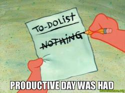
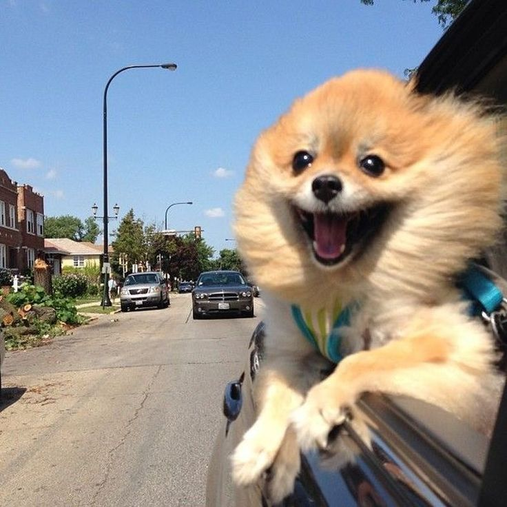
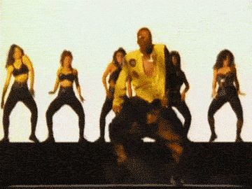
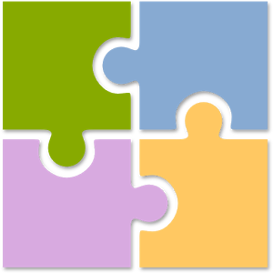
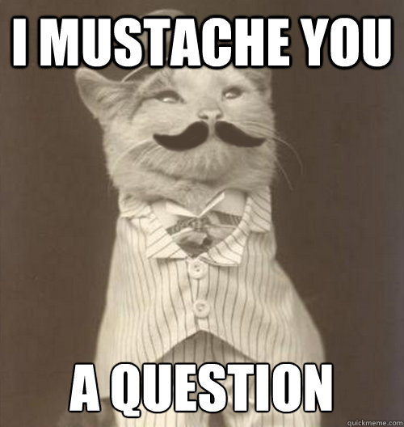

## Or... {.takeaway-center}

<!-- Global Caching --> 
```{r setup, include=FALSE}
#knitr::opts_chunk$set(cache=TRUE)
library(ggplot2)
library(reshape2)
library(DiagrammeR)
```

<!-- Plot theme --> 
```{r, include=FALSE}
gg_theme <- theme( axis.title = element_text(size = rel(2), color = "#FFFFFF")
                 , panel.grid.major = element_blank()
                 , panel.grid.minor = element_blank()
                 , axis.line = element_line(color = "#FFFFFF")
                 , panel.background = element_rect(fill = "#222222", color = "#FFFFFF")
                 , legend.background = element_rect(fill = "#222222")
                 , plot.background = element_rect(fill = "#222222")
                 , legend.key = element_rect(fill = "#222222")
                 )
```          

### &nbsp; 

### How to plan <em>just a little bit</em> so it's easy to get shit done




<!-- Why bother? 1 -->


## Why bother? {.takeaway}

```{r, include=FALSE}
why_bother <- data.frame( time = 1:10
                        , `Flailing About` = 2 + 1:10 + 1.25^(0:9)
                        , `Good Habits` = 2 + 1:10 + 1.5^(0:9)
                        , check.names = FALSE
                        )
why_bother <- melt( why_bother
                  , id.vars = "time"
                  )
why_bother$variable <- factor(why_bother$variable, levels=c("Good Habits", "Flailing About"))
```

### 1. The good habits you build now will pay dividends in the future

```{r, echo=FALSE, fig.width=6, fig.height=4}
( ggplot()
+ geom_line( data=subset(why_bother, variable=="Flailing About") 
           , aes(x=time, y=value), color="red", lwd=1.25
           )
+ geom_text( data=subset(why_bother, variable=="Flailing About" & time==9)
           , aes(x=time, y=value), color="red", size=rel(5), vjust=2.5, label="Flailing About"
           )
+ geom_line( data=subset(why_bother, variable=="Good Habits")
           , aes(x=time, y=value), color="green", lwd=1.25
           )
+ geom_text( data=subset(why_bother, variable=="Good Habits" & time==9)
           , aes(x=time, y=value), color="green", size=rel(5), vjust=5.75, label="Good Habits"
           )
+ scale_x_continuous("Time", breaks=NULL, labels=NULL)
+ scale_y_continuous("Effectiveness", breaks=NULL, labels=NULL)
+ gg_theme
)
```


<!-- Why bother? 2 -->


## Why bother? {.takeaway}

### 2. It feels good when you finish things




<!-- Why me? -->


## Why me? {.takeaway-center}

### &nbsp; 

### Important regardless of whether you're an individual contributor or a manager


<!-- What this talk is not -->


## What this talk is <u>not</u>

### &nbsp; 
- A list of random tasks to make you better
- An advertisement for a particular tool
- An exhaustive manual of being productive


<!-- What this talk is -->


## What this talk is {.takeaway-center}

### &nbsp; 

### A framework for working 

### <em>quickly</em> and <em>effectively</em>


<!-- What's the secret? -->


## What's the secret? {.takeaway-center}

### &nbsp; 

### Stop and think before you dive in


<!-- What's so special about that? -->


## What's so special about that?

### &nbsp;

Thinking first helps you:

- Prioritize tasks
- Maintain perspective
- Anticipate roadblocks


<!-- How should I think? -->


## How should I think?

### &nbsp; 

1. Map out the big steps
2. Break the big steps into bite-sized chunks
3. Identify potential surprises


<!-- Example 1 - Intro -->


## Example 1 {.takeaway-center}

### &nbsp;

#### We want to assess whether some new variables improve a previous model fit

### Let's break it down




<!-- Example 1 - Big Steps -->


## 1. Big Steps

```{r, echo=FALSE, cache=FALSE}
grViz("
digraph{
    nodesep = .25
    ranksep = 0.1
    rankdir = LR
    bgcolor = '#222222'
    fontname = 'Helvetica'
    node [fontname='Helvetica']

    subgraph steps {
        rank = same
        node [shape='plaintext', fixedsize=TRUE, fontcolor='yellow', fontsize=12]
        edge [color='#FFFFFF']
        step1 [label='Prepare the new variables']
        step2 [label='Refit the model']
        step3 [label='Compare to previous results']
        step1 -> step2 -> step3
    }
}
")
```


<!-- Example 1 - Bite-sized Chunks -->


## 2. Bite-sized Chunks

```{r, echo=FALSE, cache=FALSE}
grViz("
digraph{
    nodesep = .25
    ranksep = 0.1
    rankdir = LR
    bgcolor = '#222222'
    fontname = 'Helvetica'
    node [fontname='Helvetica']

    subgraph steps {
        rank = same
        node [shape='plaintext', fixedsize=TRUE, fontcolor='yellow', fontsize=12]
        edge [color='#FFFFFF']
        step1 [label='Prepare']
        step2 [label='Refit']
        step3 [label='Compare']
        step1 -> step2 -> step3
    }

    subgraph substeps {
        rank = same
        node [shape='plaintext', width=1.5, fixedsize=TRUE, fontcolor='#FFFFFF', fontsize=8]
        edge [arrowsize=0, penwidth=0]
        sub1 [label='&#8226; Derive new variables\\l\n&#8226; Append new variables\\l']
        sub2 [label='&#8226; Tune hyperparameters\\l\n&#8226; Save model(s)\\l']
        sub3 [label='&#8226; Calculate metrics\\l\n&#8226; Communicate\\l']
    }

    edge [arrowsize=0, penwidth=0]
    step1 -> sub1
    step2 -> sub2
    step3 -> sub3
}
")
```


<!-- Example 1 - Few Surprises -->


## 3. Surprises?

```{r, echo=FALSE, cache=FALSE}
grViz("
digraph{
    nodesep = .25
    ranksep = 0.1
    rankdir = LR
    bgcolor = '#222222'
    fontname = 'Helvetica'
    node [fontname='Helvetica']

    subgraph steps {
        rank = same
        node [shape='plaintext', fixedsize=TRUE, fontcolor='yellow', fontsize=12]
        edge [color='#FFFFFF']
        step1 [label='Prepare']
        step2 [label='Refit']
        step3 [label='Compare']
        step1 -> step2 -> step3
    }

    subgraph substeps {
        rank = same
        node [shape='plaintext', width=.8, fixedsize=TRUE, fontcolor='#FFFFFF', fontsize=8]
        edge [arrowsize=0, penwidth=0]
        sub1 [label='&#8226; Derive\\l\n&#8226; Append\\l']
        sub2 [label='&#8226; Tune\\l\n&#8226; Save\\l']
        sub3 [label='&#8226; Calculate\\l\n&#8226; Share\\l']
    }

    subgraph surprises {
        rank = same
        node [shape='plaintext', width=1.5, fixedsize=TRUE, fontcolor='red', fontsize=8]
        edge [arrowsize=0, penwidth=0]
        surprise1 [label='&#8226; Lots of missing values\\l\n&#8226; Low match rate\\l']
        surprise2 [label='&#8226; Failing to converge\\l\n&#8226; Script errors\\l']
        surprise3 [label='&#8226; Strange results\\l\n&#8226; Poor communication\\l']
    }

    edge [arrowsize=0, penwidth=0]
    step1 -> sub1 -> surprise1
    step2 -> sub2 -> surprise2
    step3 -> sub3 -> surprise3
}
")
```


<!-- Example 1 - Recap -->


## Some observations {.takeaway}

### 1. There are some project-related tasks that we seldom think about

Communication is often an afterthought when, in reality, it's one of the most important steps

## Some observations {.takeaway}

### 2. Bite-sized chunks should be both <em>mutually exclusive</em> and <em>collectively exhaustive</em>




<!-- Example 2 - Intro -->


## Example 2 {.takeaway-center}

### &nbsp;

#### We want to develop an ongoing sentiment analysis of Allstate's public brand

### Break it down redux


<!-- Example 2 - Big Steps -->


## 1. Big Steps

```{r, echo=FALSE, cache=FALSE}
grViz("
digraph{
    nodesep = .25
    ranksep = 0.1
    rankdir = LR
    bgcolor = '#222222'
    fontname = 'Helvetica'
    node [fontname='Helvetica']

    subgraph steps {
        rank = same
        node [shape='plaintext', fixedsize=TRUE, fontcolor='yellow', fontsize=12]
        edge [color='#FFFFFF']
        step1 [label='Identify data sources']
        step2 [label='Construct a data pipeline']
        step3 [label='Analyze the sentiment']
        step4 [label='Inform stakeholders']
        step1 -> step2 -> step3 -> step4
    }
}
")
```


<!-- Example 2 - Bite-sized Chunks -->


## 2. Bite-sized Chunks

```{r, echo=FALSE, cache=FALSE}
grViz("
digraph{
    nodesep = .25
    ranksep = 0.1
    rankdir = LR
    bgcolor = '#222222'
    fontname = 'Helvetica'
    node [fontname='Helvetica']

    subgraph steps {
        rank = same
        node [shape='plaintext', fixedsize=TRUE, fontcolor='yellow', fontsize=12]
        edge [color='#FFFFFF']
        step1 [label='Identify']
        step2 [label='Construct']
        step3 [label='Analyze']
        step4 [label='Inform']
        step1 -> step2 -> step3 -> step4
    }

    subgraph substeps {
        rank = same
        node [shape='plaintext', width=1.75, fixedsize=TRUE, fontcolor='#FFFFFF', fontsize=8]
        edge [arrowsize=0, penwidth=0]
        sub1 [label='&#8226; Find sources\\l\n&#8226; Vet sources\\l']
        sub2 [label='&#8226; Select language(s)\\l\n&#8226; Retain old data?\\l']
        sub3 [label='&#8226; Pick metric(s)\\l']
        sub4 [label='&#8226; Create output (e.g. report)\\l']
    }

    edge [arrowsize=0, penwidth=0]
    step1 -> sub1
    step2 -> sub2
    step3 -> sub3
    step4 -> sub4
}
")
```


<!-- Example 2 - Few Surprises -->


## 3. Surprises?

```{r, echo=FALSE, cache=FALSE}
grViz("
digraph{
    nodesep = .25
    ranksep = 0.1
    rankdir = LR
    bgcolor = '#222222'
    fontname = 'Helvetica'
    node [fontname='Helvetica']

    subgraph steps {
        rank = same
        node [shape='plaintext', fixedsize=TRUE, fontcolor='yellow', fontsize=12]
        edge [color='#FFFFFF']
        step1 [label='Identify']
        step2 [label='Construct']
        step3 [label='Analyze']
        step4 [label='Inform']
        step1 -> step2 -> step3 -> step4
    }

    subgraph substeps {
        rank = same
        node [shape='plaintext', width=1, fixedsize=TRUE, fontcolor='#FFFFFF', fontsize=8]
        edge [arrowsize=0, penwidth=0]
        sub1 [label='&#8226; Find\\l\n&#8226; Vet\\l']
        sub2 [label='&#8226; Language(s)\\l\n&#8226; Retain?\\l']
        sub3 [label='&#8226; Metric(s)\\l']
        sub4 [label='&#8226; Output\\l']
    }
    subgraph surprises {
        rank = same
        node [shape='plaintext', width=1.75, fixedsize=TRUE, fontcolor='red', fontsize=8]
        edge [arrowsize=0, penwidth=0]
        surprise1 [label='&#8226; Few quality sources\\l']
        surprise2 [label='&#8226; Languages disagree\\l']
        surprise3 [label='&#8226; No distinct results\\l']
        surprise4 [label='&#8226; Uninterpretable findings\\l']
    }

    edge [arrowsize=0, penwidth=0]
    step1 -> sub1 -> surprise1
    step2 -> sub2 -> surprise2
    step3 -> sub3 -> surprise3
    step4 -> sub4 -> surprise4
}
")
```


<!-- Example 2 - Recap -->


## More observations {.takeaway}

### 1. Sometimes we have to reapply the process to substeps

- Like constructing a data pipeline
- Or picking metrics
- Or almost everything

## More observations {.takeaway}

### 2. What makes a chunk "bite-sized"?

My rules of thumb that tell me a task is "small enough":

1. Will take at least a few hours of work 
    - e.g. vetting a particular source

<em>or</em>

2. I need to hold myself accountable for it
    - e.g. putting something on Confluence


<!-- Wait a minute... -->


## Wait a minute... {.takeaway}

### &nbsp; 

- Are these examples oversimplified? <p style="color:yellow; margin:0;">&rarr; Absolutely</p>
&nbsp;
- Did we gloss over some major steps? <p style="color:yellow; margin:0;">&rarr; Quite likely</p>
&nbsp;
- Does this diminish the usefulness of this framework? <p style="color:yellow; margin:0;">&rarr; Not even a little bit</p>


<!-- Extensions -->


## Extensions {.takeaway}

### &nbsp; 

- Estimate time to complete tasks <p style="color:yellow; margin:0;">&rarr; Less overcommiting</p>
&nbsp;
- Identify dependencies <p style="color:yellow; margin:0;">&rarr; When might we need an outside consult?</p>
&nbsp;
- Teach other people to think this way <p style="color:yellow; margin:0;">&rarr; Helping others help themselves = Exponential growth</p>
&nbsp;


<!-- Parting words -->


## Parting words {.takeaway}

### &nbsp; 

- Practice, practice, practice <p style="color:yellow; margin:0;">&rarr; Focus on the <em>process</em></p>
&nbsp;
- Cut yourself some slack <p style="color:yellow; margin:0;">&rarr; Modifying your own behavior is hard</p>
&nbsp;
- <em>Believe</em> you can get better at this<p style="color:yellow; margin:0;">&rarr; Otherwise you're likely to stop when you hit a snag</p>


<!-- Reading! -->


## Reading! {.takeaway}

### &nbsp; 

- <a href="https://www.amazon.com/Power-Habit-What-Life-Business/dp/081298160X/" target="_blank">The Power of Habit</a> <p style="color:yellow; margin:0;">&rarr; For learning why you do what you do</p>
&nbsp;
- <a href="https://www.amazon.com/How-Win-Friends-Influence-People/dp/0671027034" target="_blank">How to Win Friends and Influence People</a> <p style="color:yellow; margin:0;">&rarr; Because you don't work in a vacuum</p>
&nbsp;
- <a href="https://www.amazon.com/Effective-Executive-Definitive-Harperbusiness-Essentials/dp/0060833459/" target="_blank">The Effective Executive</a> <p style="color:yellow; margin:0;">&rarr; So you can get the right things done</p>


<!-- Questions? -->


## Questions?


